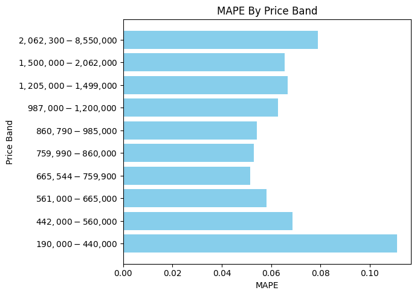
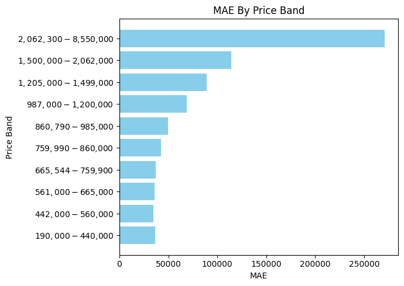

# California Home Price Prediction

## Preprocessing
`notebook02_preprocessing.ipynb`
1. **Handling Missing Values:** Removed columns with >95% missing values and imputed remaing NaN values.
2. **Converting Categorical Variables:** Binary encoded high-cardinality columns, converted boolean columns to binary, and one-hot encoded flooring type column.
3. **Normalizing Numerical Variables:** Normalized numerical columns using `StandardScaler`.
4. **Creating Train-Test Split:** Split data into training (Jan-Nov) and testing (Dec).

## Baseline Modeling
`03_baseline_model_colin_montie.ipynb`

Linear regression and Random Forest models were used as a baseline to compare the final model against.

**Baseline Metrics**
|Model|R2|MSE|MAE|RMSE|
|-----|-------------|---|---|----|
|Linear Regression|0.567|$371042345098.93|$395784.88|$609132.45|
|Random Forest|0.866|$114781779328.00|$168597.65|$338794.60|

## Feature Engineering
`notebook04_feature_engineering.ipynb`

**The following features were generated from the dataset:**
|Feature|Description|
|-------|-----------|
|BedBathRatio|Ratio of the number bedrooms in a household to the number of bathrooms|
|PropertyAge|Years since the property was built|
|NeighborsClosePrice|Average close price of the 25 closest households to the target|

## Key Features
**Key features used in the final model**
|Feature|Description|
|-------|-----------|
|LivingArea|Total interior square footage of the household|
|LotSizeArea|Total area of the property lot|
|YearBuilt|The year the property was originally constructed|
|DaysOnMarket|Total number of days the property was listed|
|BedBathRatio|Ratio of the number bedrooms in a household to the number of bathrooms|
|Parking Total|Total number of parking spaces|
|ViewYN|Whether or not the property has a view|
|PropertyAge|Years since the property was built|
|NeighborsClosePrice|Average close price of the 25 closest households to the target|

## Final Model
`05_xgboost_model_colin_montie.ipynb`

XGBoost was used for the final prediction model.

**Final Model Metrics**
|Model|R2|MSE|MAE|RMSE|MAPE|MdAPE|
|-----|-------------|---|---|----|----|-----|
|XGBoost|0.884|$155804.83|$155804.83|$314856.43|13.45%|9.09%|

**Final Model Metrics by Price Band**

